## P1 - Pesquisa de Usuários

### (a) uma descrição sucinta de sua ideia de projeto, como você espera que seu sistema seja usado, por quem e o contexto em que você espera que ele seja usado;

PlasMeDIS: Plataforma Social Moderada para a Disseminação de Informações sobre Saúde. Esse projeto é um fórum privado e personalizado projetado para facilitar a comunicação e colaboração entre estudantes. O sistema é idealmente destinado a estudantes de uma instituição educacional, como uma universidade, escola de ensino médio ou qualquer outro ambiente de aprendizado.

Espera-se que o sistema seja usado por estudantes matriculados na instituição, permitindo que eles compartilhem informações, discutam tópicos relevantes, façam perguntas, forneçam respostas e colaborem em projetos. O fórum oferece uma plataforma segura e restrita apenas aos usuários registrados da comunidade educacional, garantindo que apenas pessoas autorizadas tenham acesso às discussões e informações compartilhadas.

O contexto em que esperamos que o fórum seja usado é um ambiente educacional, onde os estudantes estão engajados em estudos, projetos e atividades relacionadas ao currículo.
O sistema do fórum visa melhorar a interação entre os estudantes, promover a troca de conhecimentos e ideias, permitir a discussão de questões relevantes e fornecer um espaço virtual seguro para a comunidade estudantil.

Além disso, o fórum pode ser personalizado para atender às necessidades específicas da instituição educacional, permitindo a criação de categorias temáticas, moderação de conteúdo, integração com outras ferramentas educacionais e recursos adicionais que aprimoram a experiência de aprendizado colaborativo.

Em resumo, o projeto consiste em um fórum privado e personalizado destinado a estudantes, fornecendo-lhes uma plataforma segura para interagir, compartilhar conhecimentos e colaborar em um ambiente educacional.

### (b) fornecer uma lista de interessados e descrevê-los no que se refere ao projeto do sistema;

 - Estudantes:
São os usuários principais do sistema de fórum.
Utilizam o fórum para se comunicar, colaborar, compartilhar conhecimentos e obter respostas para suas perguntas.
Esperam uma plataforma fácil de usar, segura e personalizada para atender às suas necessidades educacionais.

- Administradores da instituição educacional:
São responsáveis por gerenciar o sistema de fórum e garantir que ele funcione adequadamente.
Configuram as permissões de acesso, categorias e recursos do fórum.
Monitoram a atividade do fórum e tomam medidas para manter um ambiente seguro e produtivo para os estudantes.

- Professores:
Podem usar o fórum para fornecer suporte e orientação aos estudantes.
Criam tópicos de discussão, respondem a perguntas e avaliam a participação dos estudantes.
Podem usar o fórum para promover a discussão de tópicos relevantes ao currículo e estimular a interação entre os estudantes.

- Equipe de TI da instituição educacional (equipe da CodeLab):
São responsáveis por implantar, configurar e manter o sistema de fórum.
Gerenciam a infraestrutura necessária para garantir a disponibilidade e segurança do fórum.
Oferecem suporte técnico aos usuários e solucionam problemas relacionados ao sistema.

Casos de uso atuais:

- IBEAC: Instituto Brasileiro de Estudos e Apoio Comunitário Queiróz Filho. Nesta versão de sistema de cooperação com o IBEAC, os estudantes trabalham no contexto de um dos projetos do instituto, o CEPI (Centro de Excelência em Primeira Infância). Uma das necessidades do CEPI é promover a troca de informações e conhecimentos entre as gestantes e puérperas e destas com especialistas e voluntárias e voluntários do próprio Centro, além de pais, avós e demais familiares e amigos envolvidos com sua situação. A ideia do projeto é criar uma plataforma de software que permita de uma forma fácil e amigável esta interação.

- TEApp: A plataforma também foi utilizada no trabalho de mestrado da aluna Valdirene Aparecida Armenara (Ferramentas de Apoio ao Professor de Ensino Superior Sobre o Estudante com TEA: Manual e Comunidade Virtual de Aprendizagem), sob orientação das professoras Denise Stringhini e Maria Elizete Kunkel. Neste trabalho, a ferramenta foi adaptada para a criação de uma Comunidade Virtual de Aprendizagem (CVA) que reuniu docentes do ensino superior e especialistas em Transtorno do Espectro Autista (TEA) com objetivo de apoiar os docentes a acolherem estudantes com TEA de maneira apropriada. A autora atuou como moderadora e realizou testes que indicaram benefícios deste tipo de ferramenta na criação de CVAs.

### (c) Discutir os métodos de pesquisa do usuário que você usou, fornecer justificativa para eles e fornecer um resumo de suas descobertas de cada um desses métodos;

Uma pesquisa foi realizada na aplicação de um Projeto de mestrado da aluna Valdirene Armenara. Houve a participação de professores, especialistas em inclusão escolar, e estudantes com Transtorno do Espectro Autista (TEA) em uma pesquisa. No total, 15 professores foram convidados, mas apenas 12 participaram efetivamente nas fases de demonstração e avaliação. Foram convidados 16 professores especialistas da Unifesp, dos quais 6 aceitaram o convite, mas somente 3 participaram das fases de demonstração e avaliação.

Os estudantes com TEA foram indicados pelo NAI Unifesp/SJC, sendo um total de 6 indicados, porém apenas 4 aceitaram o convite para participar da pesquisa. Além dos professores da Unifesp e dos estudantes com TEA, um grupo de profissionais externos, especialistas em inclusão escolar de pessoas com TEA, foi convidado a participar. Inicialmente, a autora divulgou a pesquisa em um aplicativo de mensagens e recebeu interesse de 18 profissionais, mas devido à necessidade de respeitar a proporção aprovada pelo CEP, apenas 6 profissionais receberam o convite formal da pesquisa.

Os participantes receberam um e-mail convite que continha o link para acessar o Termo de Consentimento Livre Esclarecido (TCLE). Somente aqueles que responderam ao TCLE aceitando os termos receberam o e-mail com os links de acesso ao manual e ao aplicativo TEApp.

A pesquisadora atuou como moderadora em uma comunidade virtual de aprendizagem, que era uma rede social especializada, restrita e moderada. Ela cadastrou os novos usuários, criou senha e login, e enviou um e-mail com o link de acesso, login e senha. Além dos participantes convidados, as orientadoras da pesquisa e um aluno da graduação da equipe do CodeLab foram cadastrados para acompanhar a evolução da CVA TEApp durante as fases de demonstração e avaliação. As orientadoras atuaram como moderadoras para acompanhar as interações, enquanto o estudante do CodeLab foi o administrador responsável pela parte técnica da CVA TEApp.

Ao final da pesquisa um questionário foi aplicado `a todos os participantes. Aplicá-lo pode fornecer informações valiosas sobre a experiência e satisfação dos usuários, bem como identificar possíveis problemas ou áreas de melhoria. Alguns resultados da pesquisa podem ser conferidos nas imagens abaixo:

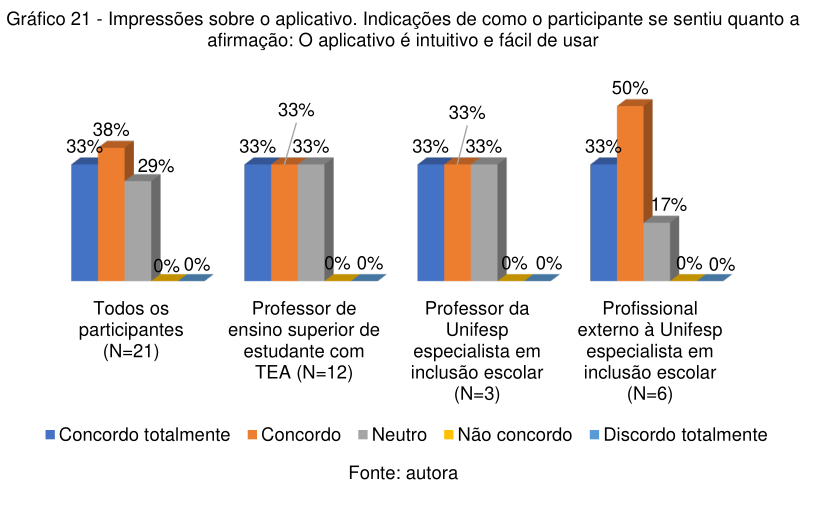
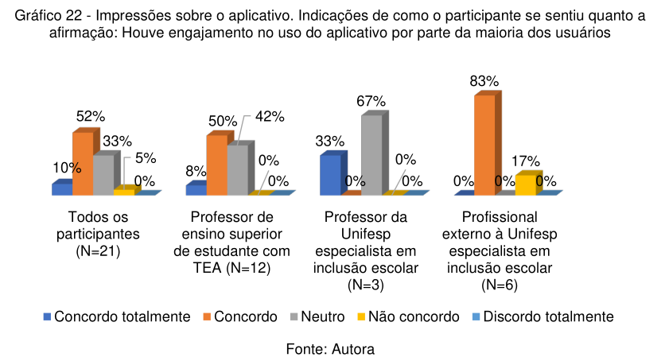
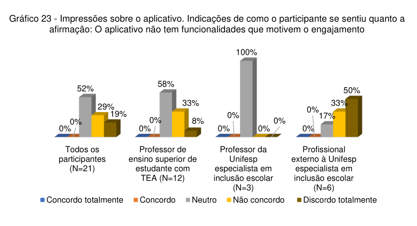
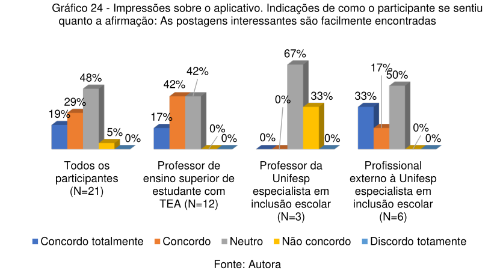
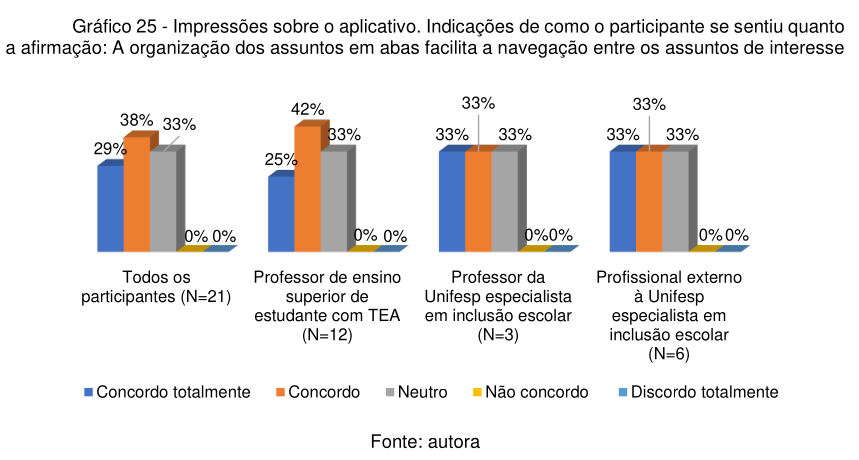
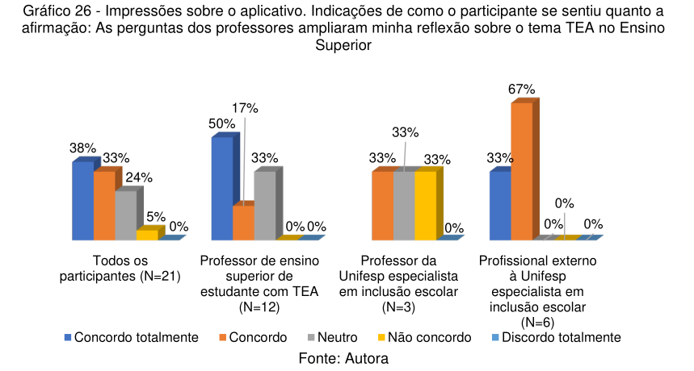
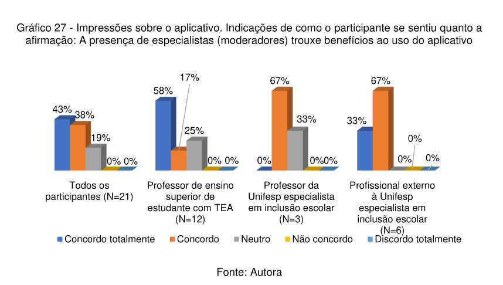
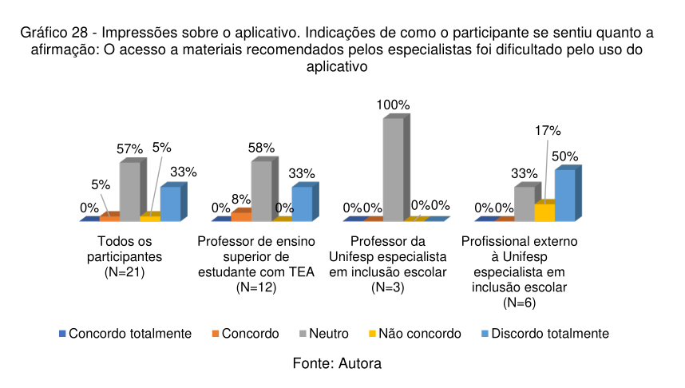
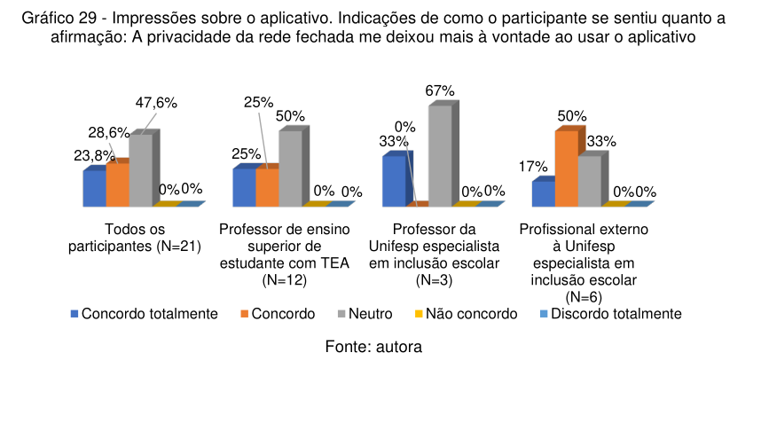
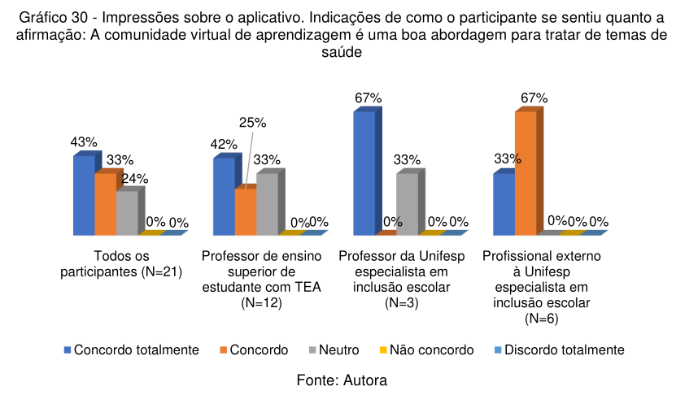
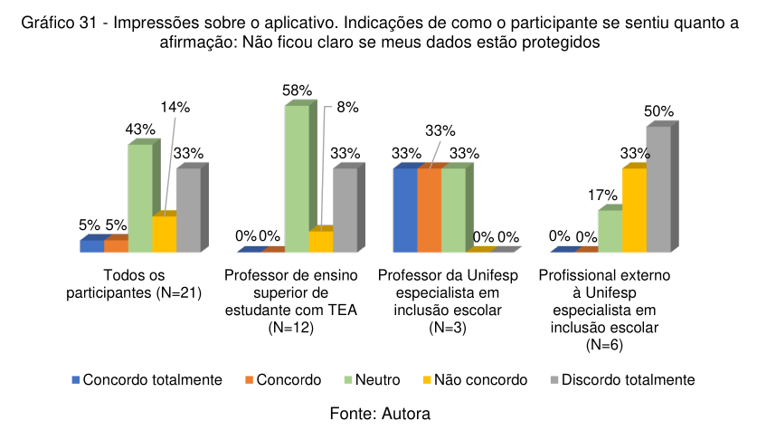
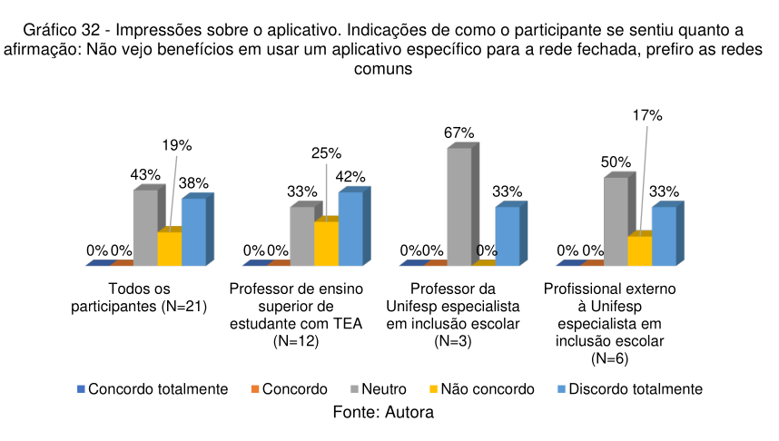
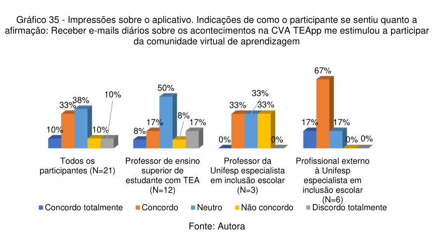

[Mais informações podem ser encontradas no texto original](https://repositorio.unifesp.br/handle/11600/65996)

Algumas conclusões que podemos tirar disso são que:
- Para fins de um fórum privado, os usuários tenderam a utilizar a aplicação via desktop (um design mobile first não seria ideal)

- Implementar features de pulse notification / notificação por email aumentam o engajamento e utilização

- A aplicação ainda precisa melhorar ferramentas de engajamento (criação de uma feature / botão de compartilhamento, implementar suporte a áudio / vídeos seria interessante)

- Será necessário reformar infomações de segurança

- As abas contendo as categorias facilitaram a navegação, no entanto um mecanismo de busca por texto poderia auxiliar o encontro de postagens

### (d) reflita sobre seu uso dos métodos -- o que deu certo, o que deu errado e o que você faria diferente

- Método **Survey**

A pesquisa realizada previamente pela Valdirene nos garantiu insights abrangentes, a coleta resultou em alguns dados quantitativos e na identificação de tendências. Ela foi realizada através de Google Forms, preenchidos individualmente por cada participante, economizando tempo e recursos.

Entretanto, perguntas mal formuladas ou respostas ambíguas podem ter levado a interpretações equivocadas dos dados coletados, além de que alguns participantes podem ter características diferentes dos demais, o que pode introduzir viés nos resultados.

Em uma outra oportunidade, poderíamos realizar um novo questionário com perguntas mais claras, objetivas e não tendenciosas para garantir respostas precisas e confiáveis. Outra melhoria seria segmentar os questionários para diferentes grupos de usuários, e complementar os questionários com outros métodos, como entrevistas, para obter insights mais profundos e compreender melhor as respostas dos participantes.

### (e) forneça de 6 a 8 descrições de tarefas de como você espera que o sistema seja usado.

- Criar um novo tópico de discussão:
Estudantes podem iniciar novas discussões sobre um determinado assunto relacionado ao currículo.
Eles fornecem um título descritivo e uma descrição detalhada do tópico, incentivando a participação de outros estudantes.

- Responder a um tópico de discussão:
Os estudantes podem ler os tópicos existentes e compartilhar suas opiniões, conhecimentos ou dúvidas relacionadas.
Eles podem fornecer respostas úteis, esclarecer conceitos e promover um ambiente colaborativo.

- Fazer perguntas aos professores:
Os estudantes podem usar o fórum para fazer perguntas específicas a professores sobre um tópico do currículo.
Eles esperam receber orientações, explicações ou recursos adicionais dos professores para aprofundar sua compreensão.

- Participar de discussões moderadas pelos professores:
Professores podem criar discussões moderadas, onde os estudantes são incentivados a compartilhar opiniões embasadas e argumentos fundamentados.
Os estudantes participam dessas discussões, seguindo diretrizes específicas para garantir um ambiente respeitoso e construtivo.

- Colaborar em projetos em grupo:
Estudantes que trabalham em projetos em grupo podem usar o fórum para se comunicar, compartilhar arquivos e coordenar suas atividades.
Eles podem criar tópicos específicos para cada projeto, acompanhar o progresso e resolver problemas em conjunto.

- Acompanhar as atualizações do fórum:
Estudantes podem acompanhar as atualizações recentes no fórum, como novos tópicos, respostas ou anúncios importantes.
Isso permite que eles estejam atualizados sobre as discussões relevantes e participem ativamente do fórum.

Materiais utilizados:

- Site da CodeLab: https://www.codelab-unifesp.org/

- Repositório do projeto:
  - API: https://github.com/UnifespCodeLab/plasmedis-api
  - Web: https://github.com/UnifespCodeLab/plasmedis-web

- Protótipo original: https://www.figma.com/file/Z0QdeIBaIOQEqHDpdP8Dqe/Admin-dash?type=design&node-id=1-41&t=SCmjqePTBwpX8dkp-0

- Valdirene Armenara, Ferramentas de apoio ao professor de ensino superior sobre o estudante com TEA: manual e comunidade virtual de aprendizagem: https://repositorio.unifesp.br/handle/11600/65996
