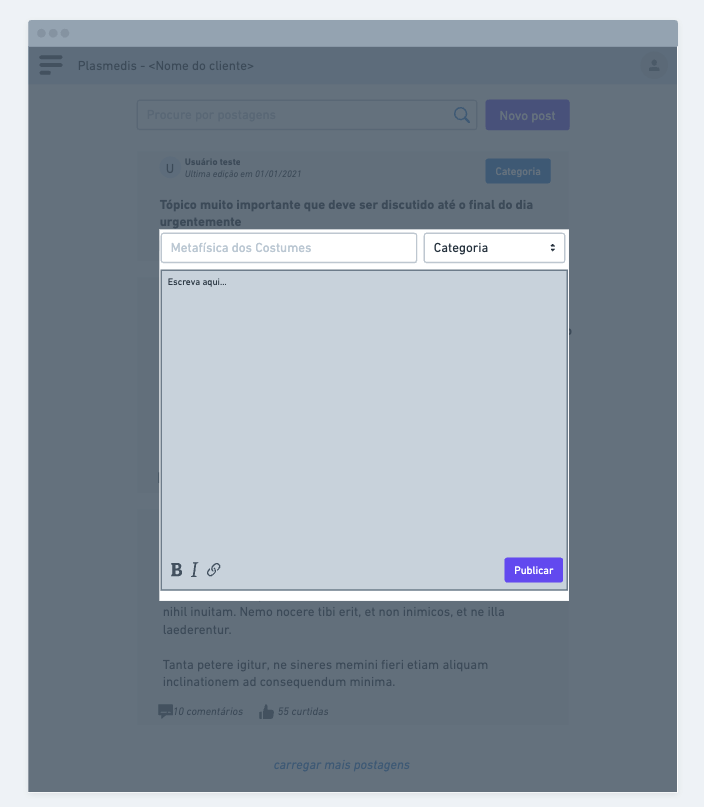

## P2 - Protótipo de Baixa Fidelidade 

Com base nas tarefas descritas na atividade anterior e nas conclusões tiradas após o estudo da pesquisa realizada pela aluna Valdirene Armenara, elaboramos algumas funcionalidades extras e mais específicas que poderiam ser implementadas na plataforma, são elas:

- Permitir que o usuário crie uma postagem ("post") com conteúdo textual livre, sendo possível estilizar em negrito ou itálico, e formatar com espaços, quebras de linhas, "bullet points", e outros. Além disso, terá a possibilidade de anexar outros tipos de mídia, tais como áudio, vídeo, imagens e links. O post deve ter obrigatoriamente um título textual, e o conteúdo será opcional. 

- Permitir que o usuário comente nos posts de forma livre, com todas as possibilidades de estilização e anexo de mídia, da mesma forma que funciona no post.

- Permitir que o usuário curta ("like") os posts, compartilhe (botão de "compartilhar" para outras redes sociais) e/ou copiem o link do post para ter acesso a ele diretamente. 

- Permitir que o usuário realize uma busca de posts da forma que desejar. O filtro será feito por título/conteúdo do post e estará disponível na página principal.

- Permitir que os usuários visualizem os posts por Categoria (funcionalidade que já existe na plataforma hoje) 

Com essas funcionalidades e as demais que já existem na plataforma, o grupo repensou algumas telas do sistema para que contemplassem as necessidades dos usuários e atendessem o máximo possível de boas práticas de UI e UX. O protótipo está disponível no link abaixo:

https://whimsical.com/low-fidelity-prototype-GSJa9b8ASjtEfYCLUGd8S8

O primeiro conjunto de 5 telas se refere ao fluxo da página de "login" e criação de conta:

Em seguida temos mais 5 telas referentes a página principal da plataforma. As telas possuem legendas e descrição dos elementos, além disso é possível observar a relação entre elas, as setas apontam para o próximo estado da aplicação após clicar em algum elemento.

### Tela inicial: 

### Menu do usuário (expandido no canto superior direito): 

### Menu lateral expandido: 

### Tela de Novo Post (modal sobre a página inicial): 

### Tela de um Post: 

